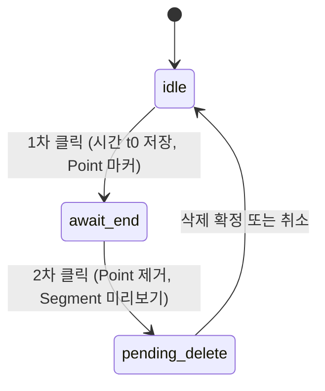

# 파형 컷 편집 (Peaks.js)

오디오 파형에서 구간을 잘라 재생 스킵(`cutRanges`)과 자막 단어 타임라인·텍스트를 함께 갱신하는 동작을 정의한다.

## 1. 도구 모드 (`activeTool`)

| 값 | 커서 | 동작 |
|----|------|------|
| `null` | 기본 | 문서/자막 편집과 동일. 파형은 보기만. |
| `CUT` | `crosshair` | 빈 파형(단어 세그먼트 밖) 클릭으로 자르기 2클릭 플로우. 세그먼트 드래그 비활성. |
| `ADJUST` | `ew-resize` | 단어 블록(세그먼트) 경계 드래그로 길이 조절. |

- 파형이 **해당 줄에 열려 있을 때만**(`activeLineIndex !== null`) 하단 플로팅 툴바를 표시한다.
- 파형을 닫거나 다른 줄로 바꿀 때 `activeTool`은 **`null`로 리셋**되어 일반 편집 모드로 돌아간다.

## 2. CUT 상태 머신

| 상태 | Peaks 객체 | UI |
|------|--------------|-----|
| `idle` | — | 툴바만 |
| `await_end` | `points.add` — 세로 **흰 점선** + 시간은 **상단** 라벨 (`createCutToolPointMarker`, Peaks 기본 포인트는 중앙 시간으로 파형을 가림) | 툴바 |
| `pending_delete` | `segments.add` — **반투명 흰색** 면 + 경계는 `markers: true` + `createCutPreviewSegmentMarker`(시작 **위** / 끝 **아래** 라벨). `markers: false`만 쓰면 Peaks `OverlaySegmentMarker`가 중앙에 검은 시간을 그림. | 툴바 + 파형 **하단 오버레이** **삭제** 버튼(가상 리스트에 잘리지 않게 `zoom` 컨테이너 `absolute`) |

**삭제 확정**: `Delete` 키 또는 **삭제** 버튼 → `onTimeRangeCut(start, end)` 호출 → 미리보기 정리 → idle.

**취소**: 도구 변경·파형 닫기·같은 플로우 재시작 시 Point/Segment 제거.

## 3. 단어 동기화 알고리즘

컷 구간 `[cutStart, cutEnd]`(오디오 타임라인 초)와 단어 `[word.start, word.end]`의 관계:

1. **완전 포함**: `cutStart ≤ word.start` 이고 `word.end ≤ cutEnd` → 단어 행에서 **제거**.
2. **겹침 없음** → 단어 **유지**.
3. **부분 겹침** → 겹친 시간만큼 타임코드를 줄이고, 제거된 구간 길이 대비 단어 길이 비율만큼 **문자열을 앞 또는 뒤에서 잘라** 빠른 가편집에 맞춘다 (유니코드 스칼라 단위 `[...str]`).
   - 앞이 잘림: `word.start`를 겹침 끝으로 옮기고 텍스트 앞부분 비율만큼 삭제.
   - 뒤가 잘림: `word.end`를 겹침 시작으로 옮기고 텍스트 뒷부분 비율만큼 삭제.
   - 가운데만 잘리면 **두 단어로 분할** (앞/뒤 구간 길이 비율로 문자 분배).

구현: `src/renderer/src/waveformCutSync.ts` — `applyTimeRangeCutToVrewRows`.

## 4. Peaks 생명주기와 오버레이

`applyWordsToPeaks`가 `segments.removeAll()`을 호출하므로, CUT 미리보기 Segment/Point는 **단어 동기화 직후 같은 틱에서 ref 기준으로 다시 그린다** (`restoreCutSelectionOverlay`). 그렇지 않으면 자막/단어 변경 시 미리보기가 사라진다.

 destroy/cleanup 시 Point/Segment id 상수:

- `autosub-cut-marker` — 1차 클릭 세로선
- `autosub-cut-preview` — 2차 클릭 후 미리보기 면

## 5. 레이아웃 (Framer / 아코디언)

줄·파형 레이아웃 애니메이션 직후 Konva 폭이 어긋날 수 있으므로, 기존 `safeFitPeaksContainerView` + 지연 refit에 **~350ms** 추가 타임아웃으로 `zoomview.fitToContainer()`를 한 번 더 호출한다.

## 6. 이벤트 분리

- **CUT**: `zoomview.click`의 `time`으로 컷만 진행. 단어 세그먼트 위 클릭은 무시(해당 `time`에 단어 세그먼트가 있으면 스킵).
- **ADJUST**: Peaks 기존 `segments.dragend`로 단어 반영(기존 로직).
